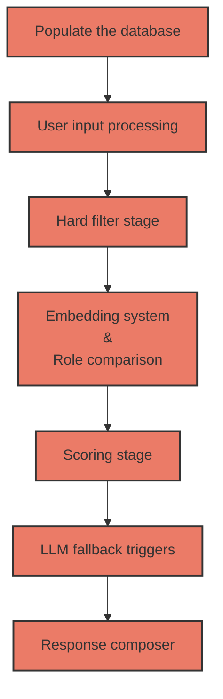

# Brihac Ana-Cristina

## Approach & Tradeoffs

I worked with LLM's in the past, through a hackathon and through an extracurricular course, so I had a
starting idea in my mind, and that was: "I need to use algorithms instead of LLMs for a **smaller cost**
and for **faster results**, and I need to populate a database with information for more **accuracy** in the final result."

It will not be a **simple** implementation, it has more phases, but that will help us with **speed**, **cost** and **accuracy**.
About **robustness**, it could break, because the methods I chose are algorithm-based, so they have more chances
of failure than an LLM, but I integrated trigger points for these moments, and the LLM will be used for them.

### Populate the database

For more accuracy, and to have more resources to work with, at the start of the generation we populate a
database using an LLM with synonyms for each company, and a separate database for the fields, which is
written manually and then reviewed and expanded by the LLM.

*How do we store the databases?*

- SQLite for the company database, because it is simpler and faster to query with SELECT.
- JSON files and hash tables for the field and role synonym tables, because when we look through them we
just need the key, and we know that a hash table has an O(1) lookup complexity. We keep the data on disk as
a JSON file, and it gets loaded into a hash table in memory when we run the program.

**The files:**

- **.env:** this is where the API key is staying
- **companies.jsonl:** the companies data from where we will extract the tables, the input data
- **companies-population.py**: it will created the database table if this not exist and then will populate it looping through the companies list. In the looping process we need to check if the company is already in the table, because by this we will save time and tokens. We will check this by reviewing the "website" field, and the "operational_name" field if the website is null. The operational_name has a small chance of being the same for two companies, so we don't rely on it as the first check, it is just a backup verification.
- **synonyms.py:** containt the script for the role and field tables verification and extansion. Just one script for both, because the task has the same purpose.
- **fields.json:** contains the synonyms of the fields, but not all of them, just the ones that make sense. For example, operational_name and website are identifier fields, so we are not going to use synonyms for them in this file.
- **roles.json:** the JSON file where the script will add the role synonyms for each company.
- **expandPrompt.txt & createPropmpt.txt:** contains the prompts for the LLM from synonyms.py
- **populatePrompt.txt:** contains the prompts for the LLM from companies-population.py

### User input processing

The user input needs to be processed so we take out the noise (the irrelevant words), extract the meaningful
words, and look through our synonym tables to see which fields it matches, and which role, if any.

*What is the role?* The role is a label a company needs, whether it acts as a supplier, manufacturer,
distributor, buyer, competitor, etc., in relation to whatever the query is asking about.

**The files:**

- **inputUser.py:** in this file we process the input. We take out the noise, the stop words, and tokenize the input. I chose **NLTK** instead of **spaCy**, because the input is not big and **NLTK** is better for small data. Then, we check the role and the fields against the tokens, but we don't use exact match logic (like strcmp), because the user input can have spelling errors. For this problem, I chose **difflib**. We check each word with the **get_close_matches** function against the list of possibilities from the JSON files from the previous step. If we check the roles for a word and we get more than one match, that becomes a trigger for the LLM. I implemented the same check for the fields too, so both go through the same ambiguity logic. Since this will be a rare case, it will not add much cost, so for accuracy we can rely on the **LLM's judgment** on those cases. We need a reverse lookup because for difflib we merge all the role synonyms into one flat list, so on its own it doesn't tell us which role a matched word belongs to. We look up the matched word in the JSON file to find out its role. The field part works the same way.
- **inputParse.json:** the output of this stage. The fields we extract are what the hard filter stage will use next to know which columns to check for each query. The role, on the other hand, is not used by the hard filter, it is a signal that is used later, in the embedding and role-comparison stage.
- **ambiguousPrompt.txt:** the prompt for the case where we have ambiguous results and we need a second pair of eyes for the perfect decision. Since there is no company data available at this stage, the only context we can give the LLM to resolve the ambiguity is the original user query itself, so this is what gets sent along with the ambiguous word and its candidates.

### Hard filter stage

Because the embedding stage is an expensive one, we need to filter the data before it runs. We do this by
reviewing the fields we considered relevant in the previous step. If a company doesn't have data in the
related field, it is categorized as **3 (inconclusive)** and exits the pipeline early.

### Embedding system & role comparison

Now we need to evaluate the filtered data. We have two stages here, computed separately, not merged into one score.
- The role comparison, where we compare the role fetched in the input processing stage with the role of the
remaining companies and assign a score. 
- The embedding system, where we see if the meaning of the words
matches. I first thought about Levenshtein distance, a token-based algorithm, or soft cosine similarity, but
the embedding system seemed the best option because it gives more accurate results for the semantic part, and
I don't need multiple methods for that, just one. 

The role stays as its own separate signal, because it catches
what the embedding alone can miss, for example a company that looks close in meaning but plays the wrong role
for the query.

### Scoring stage

In this stage we combine the signals from the previous stage and categorize it with:

- 0 (match)
- 1 (debatable)
- 2 (no match)

Companies that did not reach this stage, because they exited early at the hard filter, keep
their **3 (inconclusive)** label from that step.

### LLM fallback triggers

We have two trigger points here. 
- If the score is **1, debatable**, or if the role and embedding signals did not
agree on the same company, for example high embedding similarity but a role that does not match, that means
we hit a trigger point, so we need a second pair of eyes, the LLM, for the final result on those firms.
-  The
second trigger is when a query comes back with very few or zero results from the whole candidate pool, because
that could mean the pipeline was too strict somewhere, so the LLM checks again before we give the user an
empty or almost empty answer.

### Response composer

We need to compose a result for the user with the data we received from the last steps. We will attach in the
message the list of the inconclusive companies and a list with the matching companies that our model found,
in a pleasant design, not something too complicated, something in the terminal, but the user should understand it.

## Error Analysis

Where does your system struggle?

Show concrete examples of companies it misclassifies and explain why.

## Scaling

If the system needed to handle 100,000 companies per query instead of 500, what would you change?

## Failure Modes

When might your system produce confident but incorrect results?

What would you monitor in production to detect these failures?
Critical Thinking

The strongest submissions show deep reflection about the problem and solution.

Ask yourself questions such as:

    Where does my system work extremely well?
    Where does it fail?
    What assumptions did I make?
    How robust is the system to missing data?
    How well would this scale to millions of companies?
    What improvements would I prioritise next?
    What signals does the system rely on most heavily?
    When might those signals be misleading?

Understanding the limits of your approach is as important as demonstrating its strengths.