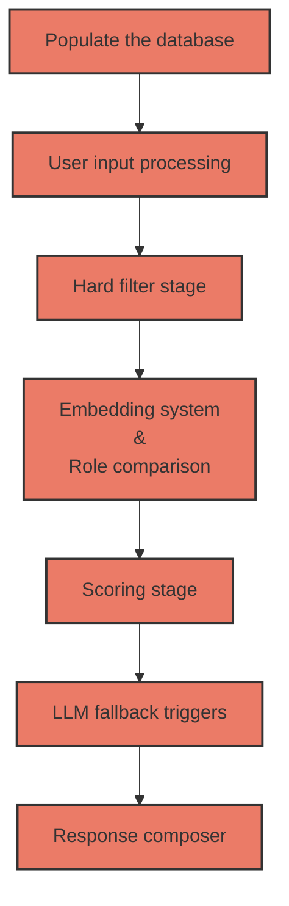

# Brihac Ana-Cristina

## Approach & Tradeoffs

I worked with LLM's in the past, through a hackathon and through an extracurricular course, so I had a
starting idea in my mind, and that was: "I need to use algorithms instead of LLMs for a **smaller cost**
and for **faster results**, and I need to populate a database with information for more **accuracy** in the final result."

It will not be a **simple** implementation, it has more phases, but that will help us with **speed**, **cost** and **accuracy**.
About **robustness**, it could break, because the methods I chose are algorithm-based, so they have more chances
of failure than an LLM, but I integrated trigger points for these moments, and the LLM will be used for them.

### Populate the database

For more accuracy, and to have more resources to work with, at the start of the generation we populate a
database using an LLM with synonyms for each company, and a separate database for the fields, which is
written manually and then reviewed and expanded by the LLM.

*How do we store the databases?*

- SQLite for the company database, because it is simpler and faster to query with SELECT.
- JSON files and hash tables for the field and role synonym tables, because when we look through them we
just need the key, and we know that a hash table has an O(1) lookup complexity. We keep the data on disk as
a JSON file, and it gets loaded into a hash table in memory when we run the program.

**The files:**

- **.env:** this is where the API key is staying
- **companies.jsonl:** the companies data from where we will extract the tables, the input data
- **companies-population.py**: it will created the database table if this not exist and then will populate it looping through the companies list. In the looping process we need to check if the company is already in the table, because by this we will save time and tokens. We will check this by reviewing the "website" field, and the "operational_name" field if the website is null. The operational_name has a small chance of being the same for two companies, so we don't rely on it as the first check, it is just a backup verification.
The embedding is not made only from the enriched description, the business model, the target markets and the core offerings are added to the text too, because those fields already hold the words that the queries ask about, like "Software-as-a-Service" or "E-commerce". The country code is also saved in its own column, because SQL cannot look inside the JSON of the address.
- **synonyms.py:** containt the script for the role and field tables verification and extansion. Just one script for both, because the task has the same purpose.
- **fields.json:** contains the synonyms of the fields, but not all of them, just the ones that make sense. For example, operational_name and website are identifier fields, so we are not going to use synonyms for them in this file.
- **roles.json:** the JSON file where the script will add the role synonyms for each company.
- **expandPrompt.txt & createPropmpt.txt:** contains the prompts for the LLM from synonyms.py
- **populatePrompt.txt:** contains the prompts for the LLM from companies-population.py
- **llmCall.py:** all the LLM calls go through one function here. It retries when the API answers with a rate limit or a temporary error, and it reads the JSON answer in one place instead of repeating the same code in four scripts. The population is 456 calls one after the other, so one failed call in the middle should not stop everything.
- **countries.json:** the country and region names that a user can write, mapped to the country code that is stored in the database. The address field only keeps the country code, like "ro" or "ch", so without this file a query that says "Romania" can never match anything.

### User input processing

The user input needs to be processed so we take out the noise (the irrelevant words), extract the meaningful
words, and look through our synonym tables to see which fields it matches, and which role, if any.

*What is the role?* The role is a label a company needs, whether it acts as a supplier, manufacturer,
distributor, buyer, competitor, etc., in relation to whatever the query is asking about.

**The files:**

- **inputUser.py:** in this file we process the input. We take out the noise, the stop words, and tokenize the input. I chose **NLTK** instead of **spaCy**, because the input is not big and **NLTK** is better for small data. Then, we check the role and the fields against the tokens, but we don't use exact match logic (like strcmp), because the user input can have spelling errors. For this problem, I chose **difflib**. We check each word with the **get_close_matches** function against the list of possibilities from the JSON files from the previous step. If we check the roles for a word and we get more than one match, that becomes a trigger for the LLM. I implemented the same check for the fields too, so both go through the same ambiguity logic. Since this will be a rare case, it will not add much cost, so for accuracy we can rely on the **LLM's judgment** on those cases. We need a reverse lookup because for difflib we merge all the role synonyms into one flat list, so on its own it doesn't tell us which role a matched word belongs to. We look up the matched word in the JSON file to find out its role. The field part works the same way.
- **inputParse.json:** the output of this stage. The fields we extract are what the hard filter stage will use next to know which columns to check for each query. The role, on the other hand, is not used by the hard filter, it is a signal that is used later, in the embedding and role-comparison stage.
- **ambiguousPrompt.txt:** the prompt for the case where we have ambiguous results and we need a second pair of eyes for the perfect decision. Since there is no company data available at this stage, the only context we can give the LLM to resolve the ambiguity is the original user query itself, so this is what gets sent along with the ambiguous word and its candidates.

### Hard filter stage

Because the embedding stage is an expensive one, we need to filter the data before it runs. We do this by
reviewing the fields we considered relevant in the previous step. A company is marked
**3 (inconclusive)** when it passes every condition that we can actually check, but a field that the query
needs is empty for it. It is not refused, it is only shown separately at the end, because "we do not know"
is a different answer from "no".

My first version of this was wrong. It was asking the database two separate questions, one for the
conditions and one for the empty fields, and the second question did not know anything about the first one.
For the query "Construction companies in the United States with revenue over 50 million" it was reporting
82 companies as inconclusive, and most of them were French, German or Chinese companies that only had an
empty revenue. They fail the country condition for sure, so they are a "no", not a "maybe". Now the two
questions are built together, one condition at a time, "the revenue is empty OR the revenue is bigger than
the value", and the real matches are removed at the end, so what is left is only the companies that we
really cannot decide.

**Files:**

- **inputUser.py:** in this file we added a functionality that reads the input and, using **spaCy**, extracts
the locations, dates, and values that will help us in the hard filter stage.
- **inputParse.json:** this file holds the needed data.
- **hardFilter.py:** the logic for filtering the data. We use the information from inputParse.json.
- **candidates.json:** the output of the hard filter stage, the companies that pass the filter and the ones
marked as inconclusive.

**Additional install:**

python -m spacy download en_core_web_sm

### Embedding system & role comparison

Now we need to evaluate the filtered data. We have two stages here, computed separately, not merged into one score.
- The role comparison, where we compare the role fetched in the input processing stage with the role of the
remaining companies and assign a score. 
- The embedding system, where we see if the meaning of the words
matches. I first thought about Levenshtein distance, a token-based algorithm, or soft cosine similarity, but
the embedding system seemed the best option because it gives more accurate results for the semantic part, and
I don't need multiple methods for that, just one. 

The role stays as its own separate signal, because it catches
what the embedding alone can miss, for example a company that looks close in meaning but plays the wrong role
for the query.

### Scoring stage

In this stage we put together the signals from the previous stage and we give every company a label:

- **0 (match)**
- **1 (not a match)**
- **3 (inconclusive)**, the ones that the hard filter put aside because a field was empty

My first idea was to compare the similarity with two fixed numbers, 0.4 and 0.7, and to send to the LLM
everything that was in the middle. After I ran it on the real data I saw that this does not work. The
similarities are all very close to each other, almost all of them are between 0.5 and 0.7, so almost every
company was falling in the middle band, and the LLM would have been called for all of them.

I also saw that the numbers move from one query to another. For one query the best company is at 0.69 and
for another one it is at 0.75, so with a fixed 0.7 the first query finds zero matches and the second one
finds a lot, and this has nothing to do with the answer being good or bad. What is good is the **order** of
the companies, the best ones are really at the top.

So I do not compare with a fixed number anymore, I compare with the **best score of that query**:

- very close to the best one, it is a match
- a little further, it is debatable, and the LLM decides
- further than that, it is not a match

I also tried to take a percentage of the list, like the best 10%, but it was worse, because the number of
real matches does not depend on how many companies passed the filter.

### LLM fallback triggers

We have two trigger points here.

- The first one is a company that the algorithm cannot decide alone, when it is in the debatable zone, or
when the two signals do not agree, for example a high similarity but a role that does not match. These
calls are limited to 10 for one query. The list is sorted, so the calls go to the companies that are really
on the border, and the ones under them are a no anyway.
- The second one is when the query comes back with almost nothing. That can mean the pipeline was too strict
somewhere, so before we answer the user with an empty list we send **one** call with the closest rejected
companies and we ask the LLM if some of them are matches. One call, not one call for each company.

I also check the roles of the query against the roles that really exist in the database. The LLM gave the
role competitor to almost no company, so a query that asks for competitors would find no role match
anywhere, every company would look like a disagreement, and the LLM would be called for all of them. A role
that is not in the database is dropped.

If the LLM cannot be reached, because of the daily limit for example, the company stays out of the matches
and the query still gives an answer. Before, one failed call was stopping the whole query.

### Response composer

We need to compose a result for the user with the data we received from the last steps. We print the
companies that matched, with their similarity, and after them, in their own section, the inconclusive firms,
because "we do not know" is not the same answer as "no". Nothing too complicated, just the terminal, but the
user should understand it.

**The files:**

- **showResult.py:** prints the answer.
- **solution.py:** runs the four stages one after the other, so everything is one command.

## Error Analysis

**The synonym matching was matching too much.** I used `difflib.get_close_matches` with its default cutoff,
0.6, and on the real queries it was giving things like this:

| word in the query | matched | ratio | it became |
| --- | --- | --- | --- |
| companies | compete | 0.62 | role competitor |
| united | listed | 0.67 | field is_public |
| states | started | 0.77 | field year_founded |
| construction | distribution | 0.67 | role distributor |
| software | store | 0.62 | role retailer |

The word "companies" is in almost every query, so almost every query was asking for the role competitor.
And "united", from "the United States", was making the system filter only the public companies, which
throws away every private construction company. The real matches are at 0.94 and above, employees is 1.00,
employee is 0.94, public is 1.00, so there is a clear space between the good ones and the bad ones and I
raised the cutoff to 0.85. The typos still work, manufaturer, distribtor, employes and suplier are all
still found, which was the reason I chose difflib from the beginning.

**spaCy said that Shopify is a country.** In "E-commerce companies using Shopify or similar platforms",
spaCy gives Shopify the label GPE, the same label as Romania or France. The old code was building a filter
for the address equal to "Shopify", and that finds nothing. Now a location is used only if the name exists
in countries.json, so Shopify is ignored and the query goes to the embedding with all the companies. The
same protection is what makes "California" harmless, it is not in the file, so it does not filter, but it
does not help either.

**The numbers were not numbers.** The values were coming out of spaCy as text, like "$50 million" or
"more than 1,000". In SQLite, when a text value cannot be turned into a number, the comparison is made by
type, and a number is always smaller than a text, so "revenue > $50 million" matches **nothing** and
"revenue < $50 million" matches **everything**. The second one is worse than a crash, because it looks like
an answer. Also spaCy puts the operator inside the entity, "more than 1,000" is one single entity, so
looking only at the two words before it was finding no operator and the condition was thrown away. And the
operator words are compared as whole words now, because "turnover" contains "over", so "turnover below 50
million" was being read as bigger than.

**The role signal is weaker than I thought.** This is how the 456 companies were labelled:

| role | companies |
| --- | --- |
| service_provider | 392 |
| manufacturer | 301 |
| supplier | 227 |
| distributor | 121 |
| retailer | 78 |
| wholesaler | 2 |
| buyer | 2 |
| competitor | 1 |

service_provider is on 86% of the companies, so it almost never separates anything. And buyer and competitor
are almost empty, and I think this is not the fault of the model. A company is not a competitor alone, it is
a competitor **to something**, and at the population there is no query yet, so the question cannot really be
answered there. My prompt even asks for the role "in relation to whatever the query is asking about", which
is impossible at that moment. wholesaler is also not one of my seven roles, the model invented it for 2
companies even if the prompt says not to.

**Where the ranking is not good enough.** I took the queries where I can build the answer from the
structured data, the country and the NAICS label, and I looked at the position of the real matches:

| query | precision in the first 10 | worst position of a real match |
| --- | --- | --- |
| logistics in Romania | 100% | 26 |
| food and beverage in France | 90% | 21 |
| pharmaceutical in Switzerland | 90% | 34 |
| renewable equipment in Scandinavia | 40% | 73 |

The Scandinavian one is clearly the weak one. I think the reason is that this dataset is full of wind and
renewable energy companies, so in that query almost everything looks similar to everything, and the
embedding cannot separate a turbine manufacturer from a company that only installs or finances turbines.

**The inconclusive list was strange at the beginning.** For the query with the clean energy startups, a lot
of companies have no year and no employee count, so I cannot check anything for them and all of them went
to the inconclusive list. The problem was that the list was starting with Unilever and OMV, and those are
not startups at all. They are not wrong, because I really cannot say no for them, but it is strange to read.
So now I compare these companies with the query too, and I show only the first ten. They already have their
embedding saved, so this does not cost me anything more.

**The same company appears more than once.** Sesame HR is in the data four times, with four different
websites, and Rompetrol and Versar are there two times. My check in the population removes a company when
the website is the same, or when the name is the same and the website is empty, so these ones pass through
it. For the query with the HR companies this was ugly, because Sesame HR was taking four places out of ten
in the answer. I did not delete them from the database, because I want to keep everything that came from the
input file, but when I print the answer I show a company only one time. I compare the name and the country
together, and not only the name, because Decathlon France and Decathlon Italy really are two different
companies.

## Scaling

If the database had 100,000 companies instead of 500, some parts still work and some parts break.

**The population becomes very expensive.** It is one LLM call and one embedding call for every company, so
for 100,000 companies it is 200,000 calls. For 456 companies it already took around 40 minutes and it used
almost all the calls that the free tier gives for one day. So this part needs a paid tier and the requests
sent in parallel, or a batch API. The good part is that it is paid only **one time**, because everything is
stored, and my script already skips the companies that are already inside, so later only the new companies
cost something.

**The similarity computation breaks.** I wrote the cosine similarity by hand, with a simple loop, and one
embedding has 3072 numbers. For 456 companies it is fast enough, but for 100,000 companies it would be
hundreds of millions of multiplications for every query, in Python, while the user is waiting. This needs a
real vector search, numpy at least, and better a library that does not compare everything, like FAISS or an
SQLite extension for vectors.

**The database becomes too big.** I keep the embedding as text, and that is around 42 KB for one company.
For 100,000 companies that is a few GB only for the vectors. Saving the numbers in binary instead of text is
a few times smaller, and the model can also return a smaller embedding.

**The hard filter is the part that scales well.** It is one SQL query, and SQLite is fine with it, it only
needs indexes on the columns that are filtered. It also becomes more important, because the more work the
cheap filter does, the less work the expensive part has to do.

**One thing in my scoring has to change.** I compare with the best score of the query, and to know the best
score I compute all the similarities and I sort them. With 100,000 companies I cannot do that, so I would
ask the vector index for the best 200 companies and measure the margin only inside that list. The companies
far away were not going to be matches anyway.

**What does not change.** The number of LLM calls for one query stays the same, 10 and one more for the
recheck, if the database has 500 companies or 100,000. This is the part of the design I would keep.

## Failure Modes

**When there is no real match at all.** The threshold is measured from the best company of the query, so the
system always believes that the best one is a match. If I ask for pharmaceutical companies in Romania and
there is none, the best Romanian company is still returned. The answer looks exactly like a correct one, and
my second trigger does not catch it, because that one looks for too few results, not for wrong ones.

**Because the similarities are very close.** The difference between the first and the second company is
often very small, so a small change in a description can change who is inside the margin and who is not. The
order is good, but the border between match and not a match is not solid.

**When the description is poor.** Everything after the hard filter depends on the enriched description, and
it was written once, at the population. If the original description is short or vague, the company will be
badly placed for every query, and I never check it again.

**When the query asks for something that is not in the data.** "Fast-growing", "B2B", "using Shopify" are
not fields. The system answers with the part that it understood and says nothing about the rest.

**When the data is missing.** Many companies have no employee count and no founding year, so for some queries
a big part of the database cannot be decided. I show them separately, but a user who reads only the matches
does not see them.

**What I would watch in production.** For every query I would save how many companies passed the filter, how
many matched, the best similarity and how many LLM calls were made. Then I would watch if the queries with
zero matches are growing, if the inconclusive ones are growing, and how often the LLM does not agree with my
thresholds, because that tells me if the thresholds are still good. And I would read a few queries by hand
every week, because no number can tell me that a confident answer was wrong.